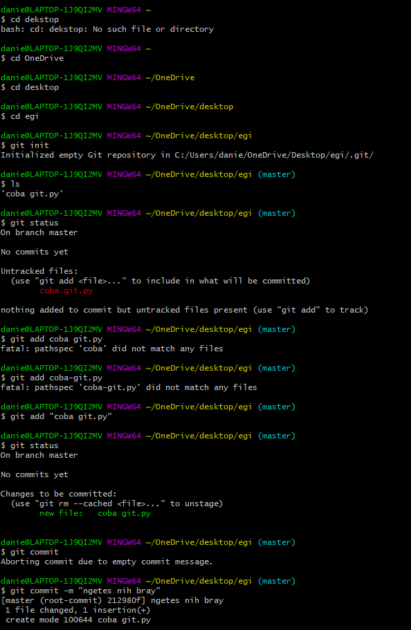
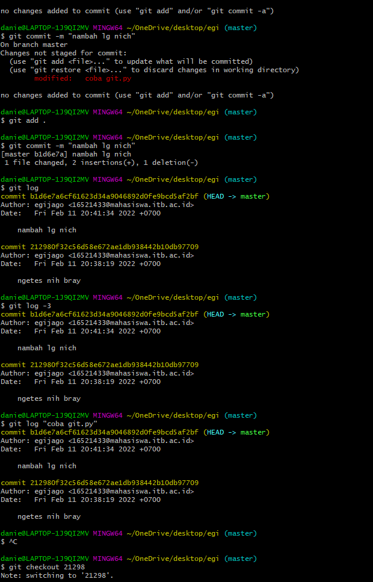

## Video 5: Bekerja dengan Git

&nbsp;

### Menginstall Git
1. Buka https://git-scm.com
2. Download Git sesuai instruksi yang tertera di laman
3. Install Git pada perangkat

&nbsp;

### Command yang dapat digunakan dalam Git
- git : menampilkan command yang dapat digunakan dalam git
- pwd : menampilkan lokasi directory saat ini
- ls : menampilkan isi directory
- cd <directory_tujuan> menuju ke directory tujuan
- git init : menjadikan direcotry sekarang sebagai repository yang akan dipantau oleh git
- git add : menambah file pada repository
- git commit -m <pesan_commit> melakukan commit terhadap perubahan sc
- git status : melihat status repository
- git log : melihat log commit
- git checkout <5digit_pertama_hash> : menuju ke sc pada commit tersebut

&nbsp;

### Praktik dari membuat repo hingga mengakses log

&nbsp;

