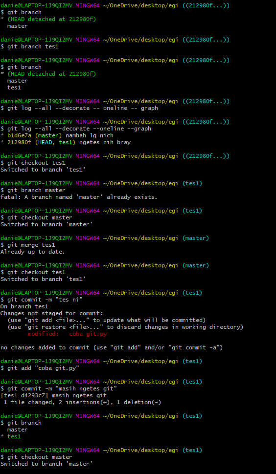
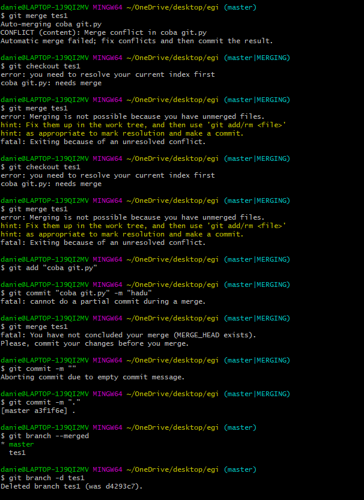

## Video 6: Git Branch & Merge

&nbsp;

### Membuat Branch
1. Pada file master, masukkan command 'git branch <nama_branch>'
2. Untuk mengedit atau memasuki branch, masukkan command 'git checkout 'nama_branch'
3. Setelah selesai mengedit branch, kembali lakukan commit

&nbsp;

### Melakukan Merging
1. Kembali checkout ke master dengan command 'git checkout master'
2. Masukkan command 'git merge <nama_branch>'
3. Branch yang telah di merge dapat dilihat dengan memasukkan command 'git branch --merged'
4. Setelah branch di merged atau sudah tidak digunakan, kita dapat menghapus branch tersebut dengan command 'git branch -d <nama_branch>'

&nbsp;

### Praktik membuat branch, merging, hingga delete branch

